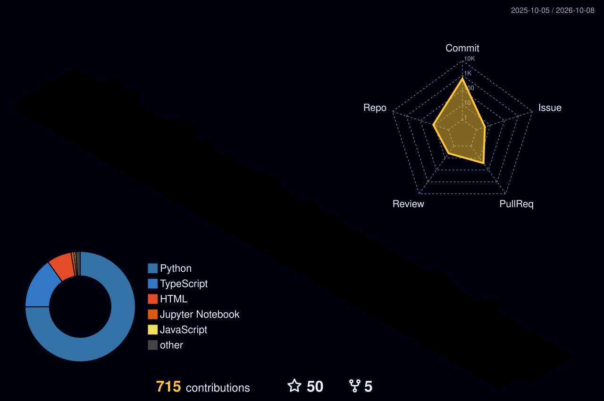

<div align="center">
  

  <a href="https://git.io/typing-svg">
    
  </a>

  <p align="center">
    <a href="https://www.linkedin.com/in/manimaran-k-4703ab30b/">
      
    </a>
    <a href="https://leetcode.com/u/Manimaran-tech/">
      
    </a>
    <a href="mailto:manimaran230806@gmail.com">
      
    </a>
    <a href="https://github.com/Manimaran-tech">
      
    </a>
  </p>
</div>

---

### ⚡ Executive Summary

```yaml
Name: Manimaran K
Role: Systems & Quantum AI Engineer | Undergraduate Researcher
Degree: B.Tech in Computer Science & Business Systems (CSBS)
Institution: Rajalakshmi Institute of Technology, Chennai, India
Core_Domains:
  - Hybrid Quantum-Classical Algorithms (Qiskit VQE, Molecular Hamiltonians)
  - Multi-Agent Autonomous Systems & Financial Governance (Consensus, Audit Chains)
  - Physics-Informed Deep Learning (PINNs, Atmospheric Reentry Dynamics)
  - High-Throughput Distributed Systems (Solana CLMM, Rust)
  - Scalable Full-Stack Engineering (FastAPI, Next.js, Docker, Microservices)
Mindset: "Engineering from foundational physical & quantum algorithms to scalable distributed architectures."
```

---

## 🧊 3D Contribution Ecosystem

<div align="center">
  <picture>
    <source media="(prefers-color-scheme: dark)" srcset="profile-3d-contrib/profile-night-rainbow.svg">
    <source media="(prefers-color-scheme: light)" srcset="profile-3d-contrib/profile-green-animate.svg">
    
  </picture>
</div>

<br/>

<div align="center">
  
</div>

<br/>

<div align="center">
  
  &nbsp;
  
</div>

<br/>

<div align="center">
  
  &nbsp;
  
</div>

---

## 🚀 Featured Flagship Projects

### 🧬 [QuantumShield — Hybrid Quantum-Classical & ML Drug Discovery Ecosystem](https://github.com/Manimaran-tech/quantumshield)
> **End-to-End *In Silico* Biophysical & Quantum Chemical Hit-to-Lead Screening Engine**

- **Generative Chemistry:** 2-layer SMILES LSTM trained on ZINC chemical libraries for *de novo* synthetically accessible drug scaffold generation.
- **Biophysical Pose Optimization:** RDKit `ETKDGv2` 3D stereochemical embedding with **MMFF94** force-field minimization and SciPy bounded `L-BFGS-B` Lennard-Jones + Coulomb electrostatic docking against target PDB crystals.
- **Quantum Ground-State Energy:** Parameterized **Qiskit 1.x VQE** ($CAS(4,4)$ active-space Hamiltonian mapped via Jordan-Wigner / Parity transformations) with real-time variational circuit simulation.
- **Thermodynamic Rigor:** Statistical thermodynamic binding affinity ($\Delta G_{\text{binding}}$, $K_d$) coupled with a virtual *in vitro* **Hill-Langmuir pharmacodynamic twin**.
- **Stack:** `Python` · `Qiskit 1.x` · `PyTorch` · `RDKit` · `SciPy` · `TypeScript` · `Next.js` · `FastAPI` · `Docker` · `Railway` · `Render`

```
[ZINC SMILES LSTM] ──> [RDKit MMFF94] ──> [L-BFGS-B Docking] ──> [Qiskit VQE Solver] ──> [Hill-Langmuir PD Twin]
```

---

### 🏛️ [TrustVault — Institutional Multi-Agent Governance & Decision Platform](https://github.com/Manimaran-tech/trust-vault)
> **Multi-Agent Financial Risk Governance with Real-Time Consensus & Cryptographic Audit Chains**

- **Quantitative LLM Council:** Six specialized domain agents (Return, Liquidity, Cost, Volatility, Capital, Risk) executing quantitative checks and LLM-backed qualitative vetoes.
- **Consensus & Circuit Breakers:** Weighted dynamic majority quorum with strict drawdown breakers and unyielding mandate enforcement.
- **Tamper-Proof Audit & Voice Telemetry:** SHA-256 hash-chained immutable audit log; integrated with Stitch double-entry ledgers and ElevenLabs real-time voice constraint interfaces.
- **Stack:** `Python` · `FastAPI` · `Multi-Agent Architectures` · `PostgreSQL` · `Redis` · `Docker` · `ElevenLabs`

---

### ⚡ [YieldSense — Solana-Based CLMM Infrastructure](https://github.com/Manimaran-tech/stable_yeildsense)
> **High-Performance Concentrated Liquidity Market Maker Protocol on Solana**

- **Concentrated Liquidity Math:** Custom tick math and dynamic range-bounded liquidity provisioning algorithms for capital-efficient DEX architectures.
- **On-Chain Security:** Program-derived address (PDA) vault segregation, slippage protection, and sub-second fee compounding execution.
- **Stack:** `Solana` · `Rust` · `Anchor Framework` · `DeFi Primitives` · `TypeScript`

---

### 🛰️ [PINN Orbital Reentry Prediction](https://github.com/Manimaran-tech/pinn-orbital-reentry-prediction)
> **Physics-Informed Neural Networks for Spacecraft Aerodynamic Decay Modeling**

- **Physical Law Integration:** Direct embedding of upper atmospheric drag, orbital mechanics, and gravitational ODEs into neural loss gradients.
- **Generalization:** Outperformed naive black-box regressors across sparse and irregular satellite telemetry regimes.
- **Stack:** `Python` · `PyTorch` · `PINNs` · `SciPy` · `Orbital Mechanics`

---

### 📈 [Stock Market Time-Series Analysis (NVDA Case Study)](https://github.com/Manimaran-tech/Stock_Analysis_NVDA)
> **Deep Learning Sequence Modeling for High-Volatility Financial Assets**

- Built an LSTM recurrent neural network architecture designed to resolve complex long-range temporal dependencies in equity pricing.
- Automated pipeline for feature scaling, sequence sliding-window formulation, and multi-horizon forecasting.
- **Stack:** `Python` · `TensorFlow/Keras` · `LSTM` · `Pandas` · `NumPy`

---

## 🛠️ Technical Arsenal

<div align="center">

### 💻 Programming Languages
<p>
  
  
  
  
  
  
  
  
  
</p>

### ⚛️ Quantum, Scientific & Biophysical AI
<p>
  
  
  
  
  
  
</p>

### 🧠 Deep Learning, Multi-Agent & Machine Learning
<p>
  
  
  
  
  
  
</p>

### 🌐 Frontend & Modern Web Architecture
<p>
  
  
  
  
  
  
</p>

### ⚙️ Systems, Cloud & Infrastructure
<p>
  
  
  
  
  
  
  
  
</p>

</div>

---

## 🎯 Research Horizons & Current Objectives (2025–2026)

- ⚛️ **Quantum-Classical Hybrid Algorithms:** Advancing VQE active-space formulations for complex biomolecular binding pocket calculations.
- 📜 **Scientific Publications:** Authoring peer-reviewed works bridging Physics-Informed Neural Networks (PINNs) and quantum chemistry.
- 🏛️ **Autonomous Governance & Multi-Agent Consensus:** Advancing verifiable LLM council architectures and cryptographic audit chains.
- ⚡ **Ultra-Low Latency Systems:** Expanding high-frequency decentralized financial primitives on Solana.

---

<div align="center">
  <h2>📬 Connect With Me</h2>
  <p>Always open to collaborating on high-impact research, open-source architectures, and cutting-edge engineering systems.</p>

  <p>
    <a href="https://www.linkedin.com/in/manimaran-k-4703ab30b/">
      
    </a>
    &nbsp;
    <a href="https://leetcode.com/u/Manimaran-tech/">
      
    </a>
    &nbsp;
    <a href="mailto:manimaran230806@gmail.com">
      
    </a>
  </p>

  <br/>
  
</div>
